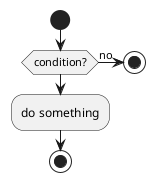
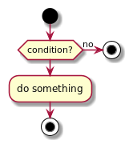

# 💔 BREAK (Business Rules Extractor, Analyzer, Knowledge)

BREAK (Business Rules Extractor, Analyzer, Knowledge) is a maven plugin to extract, analyze and create a knowledge base from your business rules. Business rules should be owned by the business (PO, BA) but what if they are gone? There is actually a need for retro documentation, living documentation generation or even reverse engineering but no tool to get easily existing business rules on a project when there is no living doc.

## Objective

Get business rules of Java projects through a Maven plugin. Following this, maybe there will be a Gradle plugin and a support for other languages such as Kotlin.

## Features

Extract business rules through an business rules extractor engine, then analyze them and create a knowledge base (for the moment generated PlantUML [activity diagrams](https://plantuml.com/fr/activity-diagram-beta) `*.puml` as decisions' trees).  
The engine extracts business rules by entering projects from any entrypoint (REST controllers, Kafka consumers...) and then the diagram builder builds the PlantUML activity diagram for each entrypoint.

## What is a business rule?

Any condition that can be used to decide a decision such as:

```java
if (condition) {
    // do something
}
```

Will generate such a PlantUML activity diagram:





